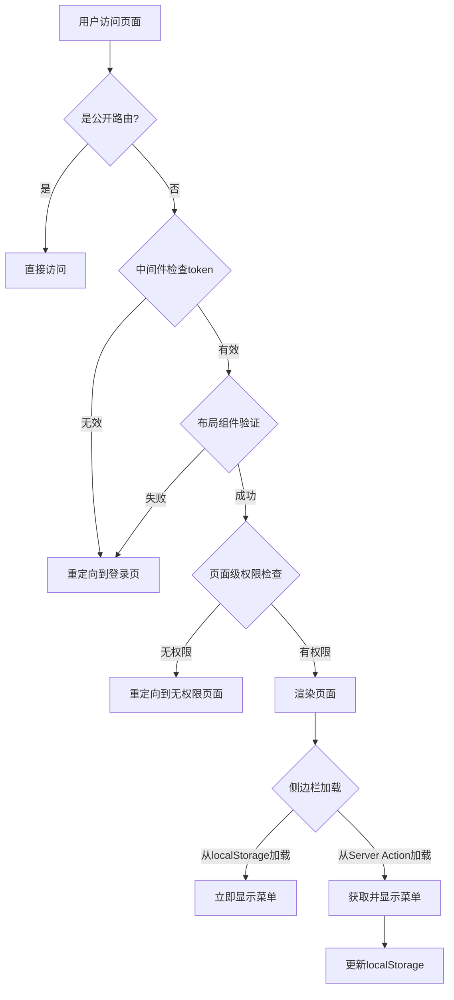

```mermaid
flowchart TD
    A[用户访问页面] --> B{是公开路由?}
    B -->|是| C[直接访问]
    B -->|否| D{中间件检查token}
    D -->|无效| E[重定向到登录页]
    D -->|有效| F{布局组件验证}
    F -->|失败| E
    F -->|成功| G{页面级权限检查}
    G -->|无权限| H[重定向到无权限页面]
    G -->|有权限| I[渲染页面]
    I --> J{侧边栏加载}
    J -->|从localStorage加载| K[立即显示菜单]
    J -->|从Server Action加载| L[获取并显示菜单]
    L --> M[更新localStorage]
```