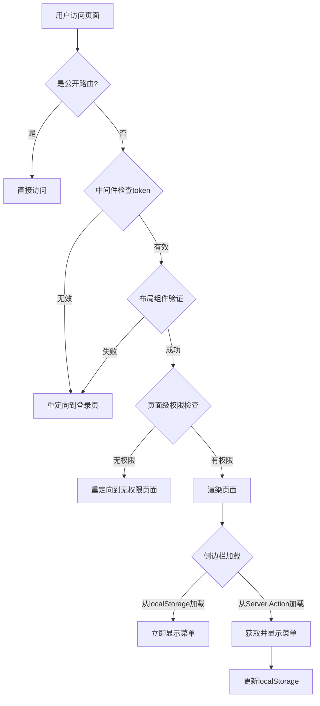
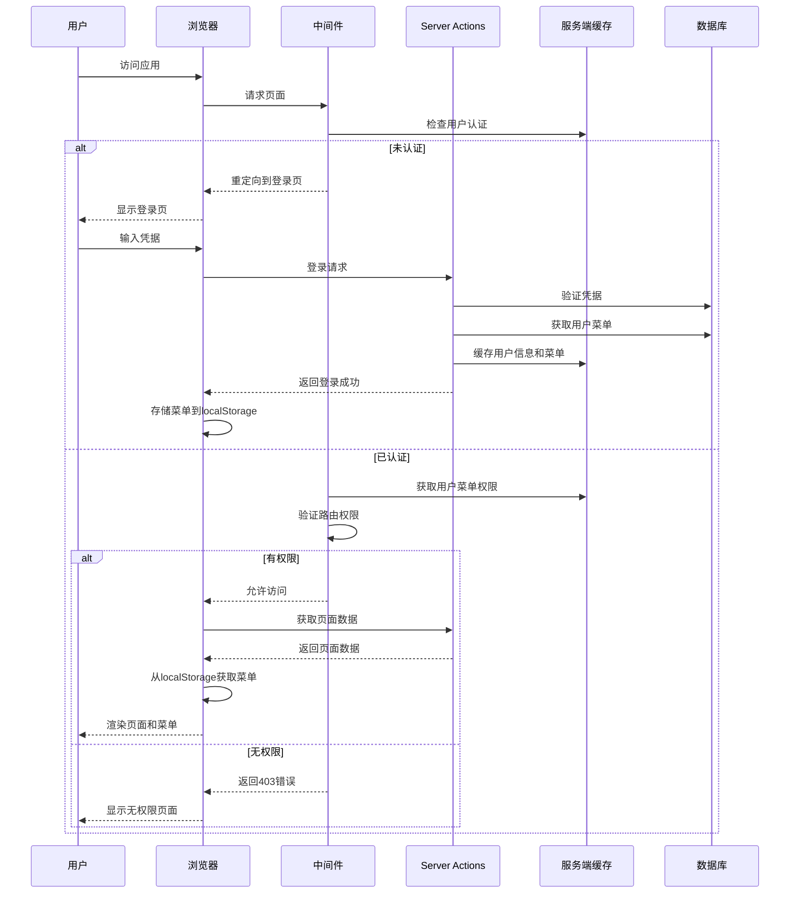

### 登录流程

### 实现细节

#### 菜单数据持久化
- 服务端使用 serviceCache 缓存菜单数据
- 客户端使用 localStorage 存储菜单数据
- 刷新页面时优先从 localStorage 获取，保证用户体验

#### 权限验证层次
- 中间件：基础认证和路由权限控制
- 组件级：动态显示有权限的菜单项
- 页面级：可以使用 Server Actions 进行细粒度权限控制

#### 错误处理
- 添加了完善的错误处理和日志记录
- 优雅降级，即使菜单加载失败也不会影响整体应用

### 数据流程图
