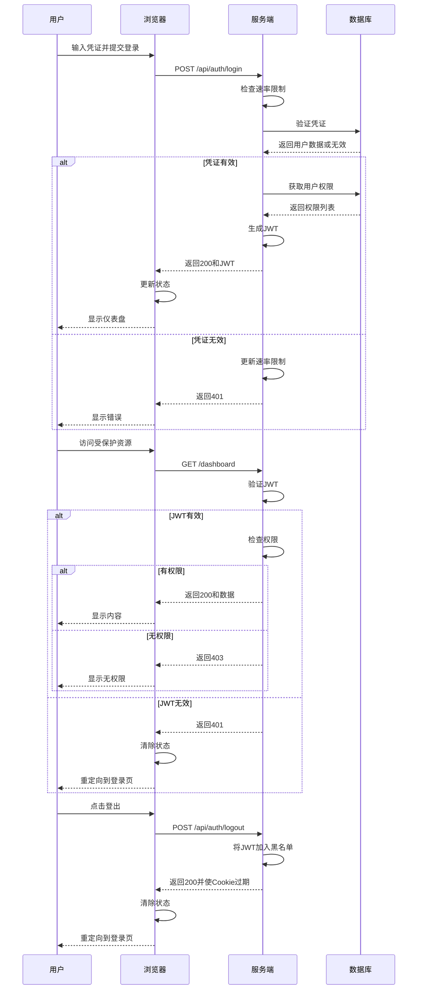

# Next.js 认证与授权设计文档

## 1. 概述

本文档旨在阐述 Next.js 应用中的认证（Authentication）与授权（Authorization）流程设计。系统将利用存储在 HttpOnly Cookie 中的 JSON Web Tokens (JWT) 来保障安全性，通过客户端状态管理库提升 UI 响应性，并采用轻量级的服务端缓存 (`lru-cache`) 进行性能优化及实现如令牌吊销等特定安全功能。

**目标:** 实现一个安全、健壮且用户友好的认证授权体系，清晰分离客户端 UI 状态与服务端验证逻辑，并集成基于角色的访问控制 (RBAC)。

**关键技术:**

- **框架:** Next.js (App Router 或 Pages Router)
- **认证机制:** JWT (存储于 HttpOnly Cookies)
- **客户端状态管理:** React Context / Zustand / Redux (择一)
- **服务端缓存:** `lru-cache` (或类似内存缓存库)
- **数据库:** (指定你的数据库, 例如 PostgreSQL, MongoDB)

## 2. 核心概念：关注点分离

清晰界定客户端和服务端在认证授权流程中的职责至关重要：

- **服务端 (Next.js API Routes / Server Components / Server Actions):**
  - **角色:** 认证状态的最终权威。负责验证用户凭证、签发令牌、在每个受保护的请求中验证令牌、与数据库交互、执行敏感操作以及基于权限的访问控制。
  - **状态:** 对于两次 HTTP 请求之间的用户会话，服务端通常是**无状态的**。它依赖于客户端**每次请求**中携带的令牌来进行验证。
  - **缓存 (`lru-cache`):** 作为**优化**和**安全增强**层（例如 JWT 黑名单、速率限制、缓存权限数据），*而不是*存储核心的“用户是否已登录”状态。
- **客户端 (浏览器 - React Components):**
  - **角色:** 根据认证状态管理 UI、存储（隐式地通过 HttpOnly Cookie）从服务端获取的令牌、在请求中携带认证凭证、持有用户信息用于展示、根据用户权限动态调整 UI（如菜单、按钮）。
  - **状态 (`store`):** 维护*客户端自身感知*的认证状态（如 `isAuthenticated`, `user` 对象包含角色/权限信息），以便高效渲染正确的 UI 元素。它信任服务端的验证结果。
- **令牌 (JWT in HttpOnly Cookie):**
  - **角色:** 连接客户端与服务端的安全桥梁。它是客户端出示、服务端验证的凭证。存储在 HttpOnly Cookie 中可增强对 XSS 攻击的防护，因为客户端 JavaScript 无法直接访问它。

## 3. 涉及组件

- **客户端 Store:** (例如 Zustand store) 持有 `isAuthenticated`, `user` (包含 id, name, email, roles, permissions), `isLoading` 等状态。
- **HttpOnly Cookie:** 安全地存储 JWT，由浏览器自动随请求发送。由服务端设置。
- **Next.js API Routes / Server Actions:** 处理 `/login`, `/logout`, `/register`, `/api/user/me` (获取当前用户信息), 以及受保护的数据接口。
- **服务端缓存 (`lru-cache` 实例):** 服务端的内存缓存，用于特定目的（见第 7 节）。
- **数据库:** 存储用户凭证（哈希后的密码！）、个人资料、角色、权限以及它们之间的关联关系。

## 4. 认证流程

### 4.1. 登录流程

1.  **客户端 (UI):** 用户提交登录表单（如邮箱/密码）。
2.  **客户端 (Action):** 调用 `/api/auth/login` 接口，在请求体中发送凭证。更新客户端 store (`isLoading = true`)。
3.  **服务端 (API Route):**
    - 接收凭证。
    - **(可选: 速率限制检查)** 查询 `lru-cache` 检查此用户/IP 的登录尝试次数。
    - 对照**数据库**验证凭证（比较哈希密码）。
    - 若有效:
      - 生成 JWT，包含用户 ID、角色(roles)、过期时间(exp)等关键信息。**(注意：通常不建议将所有权限放入 JWT，可能导致其过大，角色通常足够)**。
      - 在响应头的 `Set-Cookie` 中设置 JWT (标记为 `HttpOnly`, `Secure`, `SameSite=Lax/Strict`)。
      - **(可选: 速率限制更新)** 重置 `lru-cache` 中的失败尝试计数器。
      - 发送成功响应（例如 `{ success: true, user: { id, name, email, roles, permissions } }`，包含用户基本信息及权限）。
    - 若无效:
      - **(可选: 速率限制更新)** 增加 `lru-cache` 中的失败尝试计数器。
      - 发送错误响应（例如 401 Unauthorized）。
4.  **客户端 (Response Handling):**
    - 接收响应。
    - 若成功:
      - 浏览器自动存储 HttpOnly cookie。
      - 更新**客户端 Store** (`isAuthenticated = true`, `user = userData`, `isLoading = false`)。`userData` 应包含角色和权限信息。
      - 重定向用户到仪表盘或相应更新 UI。
    - 若失败:
      - 更新**客户端 Store** (`isLoading = false`)。
      - 向用户显示错误信息。

### 4.2. 访问受保护资源 (API 或页面)

1.  **客户端 (UI/Action):** 用户导航到受保护页面或触发需要认证的操作（如获取用户资料）。
2.  **客户端 (Request):** 向服务端发起请求（例如 `Workspace('/api/profile')` 或导航到 `/dashboard`）。浏览器**自动携带包含 JWT 的 HttpOnly Cookie**。
3.  **服务端 (Middleware / API Route / Server Component):**
    - 接收请求，从 Cookie 中提取 JWT。
    - **验证 JWT:**
      - 检查签名。
      - 检查过期时间。
      - **(关键: 吊销检查)** 检查 JWT ID (JTI, 如果使用) 是否存在于 **`lru-cache` 黑名单**中。若存在，则视为无效。
    - 若 JWT 有效且未被吊销:
      - **授权检查:** 从 JWT 中提取用户角色/权限，或根据用户 ID 从数据库/缓存中获取权限。检查用户是否有访问此资源所需的权限。
      - **(可选: 权限/数据缓存)** 如果获取的是可缓存的用户特定数据（如详细权限列表），先检查 `lru-cache`，若未命中再查询**数据库**，并将结果存入缓存。
      - 若授权通过：处理请求（从数据库获取数据、渲染页面等）。
      - 若授权失败：发送 403 Forbidden 响应。
      - 将请求的数据或渲染的页面返回给客户端。
    - 若 JWT 无效或被吊销:
      - 发送 401 Unauthorized 响应，或重定向到登录页。
4.  **客户端 (Response Handling):**
    - 若成功 (2xx): 渲染页面或展示接收到的数据。
    - 若失败 (401/403):
      - 更新**客户端 Store** (`isAuthenticated = false`, `user = null`)。
      - 重定向用户到登录页面。

### 4.3. 登出流程

1.  **客户端 (UI):** 用户点击“登出”按钮。
2.  **客户端 (Action):** 调用 `/api/auth/logout` 接口。
3.  **服务端 (API Route):**
    - 从请求 Cookie 中提取 JWT。
    - **(关键: 加入黑名单)** 将该 JWT 的唯一标识符 (JTI 或 token 本身) 添加到 **`lru-cache` 黑名单**中，并设置其 TTL 等于该 token 剩余的有效时间。
    - 在响应头中设置一个同名但已过期的 `Set-Cookie` 来清除客户端的认证 Cookie。
    - 发送成功响应。
4.  **客户端 (Response Handling):**
    - 接收到成功响应。
    - 清除**客户端 Store** (`isAuthenticated = false`, `user = null`)。
    - 重定向用户到登录页或首页。

### 4.4. 初始加载 / 会话检查

1.  **客户端 (App Load):** Next.js 应用在浏览器中加载。
2.  **客户端 (Effect/Loader):** 通常会运行一个初始副作用函数来检查用户状态（例如，通过调用 `/api/user/me` 接口）。
3.  **客户端 (Request):** 发送请求到 `/api/user/me`。如果存在认证 Cookie，浏览器会自动携带。
4.  **服务端 (API Route):**
    - 验证 JWT (同 4.2 流程)。
    - 若有效: 响应包含用户数据（含角色权限）`{ user: { id, name, email, roles, permissions } }`。
    - 若无效/缺失: 响应 401。
5.  **客户端 (Response Handling):**
    - 若成功: 更新**客户端 Store** (`isAuthenticated = true`, `user = userData`)。UI 反映登录状态，并可根据权限渲染菜单等。
    - 若 401: 更新**客户端 Store** (`isAuthenticated = false`, `user = null`)。UI 反映登出状态。

## 5. 角色、权限与菜单设计思路 (RBAC)

采用基于角色的访问控制 (Role-Based Access Control, RBAC) 模型来管理用户权限和动态菜单。

- **核心关系:**
  - 用户 (User) 被分配一个或多个 **角色 (Role)**。
  - 角色 (Role) 拥有一个或多个 **权限 (Permission)**。
  - 权限 (Permission) 代表执行特定操作或访问特定资源的许可（例如 `read:user`, `edit:article`, `access:admin_panel`）。
- **数据库设计:**
  - 需要 `Users`, `Roles`, `Permissions` 表/集合。
  - 需要关联表/集合：`UserRoles` (多对多，用户<->角色)，`RolePermissions` (多对多，角色<->权限)。
- **JWT Payload:**
  - 用户成功登录后，服务端生成的 JWT 中应包含用户的 **角色列表 (Roles)**。这样服务端在后续请求中可以快速进行基于角色的基础校验，而无需每次都查数据库。对于需要精细到具体权限的校验，仍需查询数据库或缓存。
- **服务端授权:**
  - 在 API 路由或 Server Component 的处理逻辑（或通过中间件）中：
    1.  验证 JWT 合法性。
    2.  提取用户 ID 和 JWT 中的角色。
    3.  根据请求的资源，确定所需的权限 (Permission)。
    4.  查询数据库（或检查缓存）以确定用户拥有的角色是否包含所需权限。
    5.  如果权限满足，则继续处理请求；否则返回 403 Forbidden。
- **客户端权限控制:**
  - **存储:** 登录成功后，从服务端获取的用户信息（包含角色和权限列表）应存储在**客户端 Store** 的 `user` 对象中。
  - **动态菜单:**
    - 定义一个包含所有可能菜单项的列表（可在前端定义或从后端获取），每个菜单项关联一个或多个**必需权限**。
    - 客户端在渲染菜单时，遍历此列表，只显示当前登录用户（根据其在 Store 中的权限）拥有所需权限的菜单项。
  - **UI 元素显隐:**
    - 对于页面内的按钮、链接、表单字段等需要权限控制的元素，同样使用客户端 Store 中的用户权限信息来决定是否渲染或禁用它们。例如：`{user.permissions.includes('edit:article') && <button>Edit</button>}`。
  - **前端预校验 (可选):** 可以在用户尝试执行操作前，基于客户端 Store 中的权限进行初步检查，但这**不能替代**服务端必须进行的严格授权校验。
- **权限数据缓存:**
  - 服务端可以使用 `lru-cache` 缓存用户的详细权限列表（Key: UserID, Value: Permission Array/Set），以减少在授权检查过程中对数据库的频繁查询。缓存的 TTL 应根据权限变更的频率来设定，并考虑相应的缓存失效策略。

## 6. 流程图 (Mermaid Sequence Diagram)

## 7. 服务端缓存 (`lru-cache`) 用途详解

服务端的 `lru-cache` 实例将主要用于以下场景：

1.  **JWT 黑名单/吊销:**
    - **Key:** JWT ID (JTI claim) 或 token 的唯一哈希。
    - **Value:** `true` 或时间戳。
    - **TTL:** 设置为被吊销 JWT 剩余的有效时间。
    - **目的:** 在用户登出或发生安全事件时，能够立即让特定 token 失效，无需等待其自然过期。
2.  **速率限制:**
    - **Key:** IP 地址或 用户 ID + 操作标识 (例如 `login_attempt:user@example.com`)。
    - **Value:** `{ count: number, timestamp: number }`。
    - **TTL:** 较短的时间（例如 15 分钟）。
    - **目的:** 防止对登录/注册接口的暴力破解攻击。
3.  **权限/角色数据缓存 (可选):**
    - **Key:** 用户 ID (例如 `user_permissions:123`)。
    - **Value:** 用户的角色列表或权限对象/数组。
    - **TTL:** 中等时长（例如 5-30 分钟），取决于权限变更频率。若变更频繁，需配合有效的缓存失效策略。
    - **目的:** 在服务端进行授权检查时，缓存访问频繁且相对静态的用户权限数据，减少数据库查询压力。

## 8. 安全注意事项

- **HTTPS:** 整个应用**必须**通过 HTTPS 提供服务，保护传输中的凭证和令牌。
- **HttpOnly Cookies:** 对于防御试图窃取 JWT 的 XSS 攻击至关重要。
- **Secure Flag:** Cookie 应设置 `Secure` 标记，确保只在 HTTPS 连接下发送。
- **SameSite Flag:** 使用 `SameSite=Lax`（平衡安全与可用性）或 `SameSite=Strict`（最安全，但可能影响跨站导航体验）。
- **密码哈希:** 使用强壮的、加盐的哈希算法（如 bcrypt, Argon2）存储密码。
- **输入验证:** 在服务端对所有用户输入进行严格验证。
- **CSRF 防护:** 如果未使用 `SameSite=Strict` cookies 或处理关键操作，需实施 CSRF 令牌防护，尤其是在 Pages Router 或传统表单提交场景下。App Router 中的 Server Actions 通常内置 CSRF 防护。
- **令牌有效期:** 保持 JWT 的有效期（尤其是访问令牌 Access Token）相对较短（例如 15-60 分钟）。如果需要长期登录，应实施刷新令牌 (Refresh Token) 机制。

## 9. 技术选型总结

- **客户端状态管理:** [指定选用的库, 例如 Zustand]
- **服务端缓存:** `lru-cache`
- **令牌存储:** HttpOnly Cookies

---
