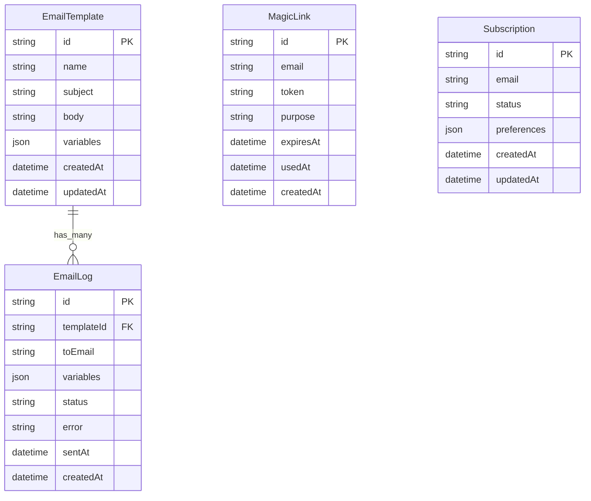
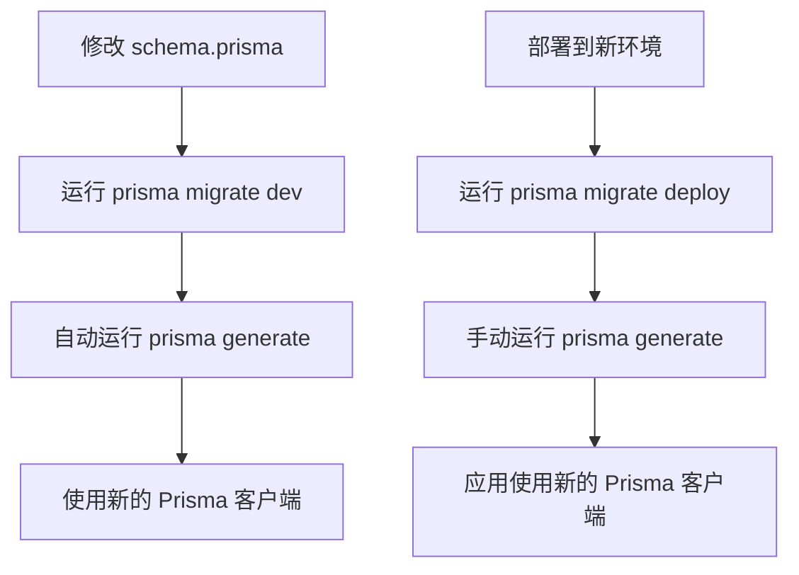

# 数据库设计

## 数据库表结构

```mermaid
erDiagram
    EmailTemplate ||--o{ EmailLog : "has_many"
    EmailTemplate {
        string id PK
        string name
        string subject
        string body
        json variables
        datetime createdAt
        datetime updatedAt
    }
    EmailLog {
        string id PK
        string templateId FK
        string toEmail
        json variables
        string status
        string error
        datetime sentAt
        datetime createdAt
    }
    MagicLink {
        string id PK
        string email
        string token
        string purpose
        datetime expiresAt
        datetime usedAt
        datetime createdAt
    }
    Subscription {
        string id PK
        string email
        string status
        json preferences
        datetime createdAt
        datetime updatedAt
    }
```

### Prisma 执行过程

```mermaid
graph TD
    A[修改 schema.prisma] --> B[运行 prisma migrate dev]
    B --> C[自动运行 prisma generate]
    C --> D[使用新的 Prisma 客户端]

    E[部署到新环境] --> F[运行 prisma migrate deploy]
    F --> G[手动运行 prisma generate]
    G --> H[应用使用新的 Prisma 客户端]
```